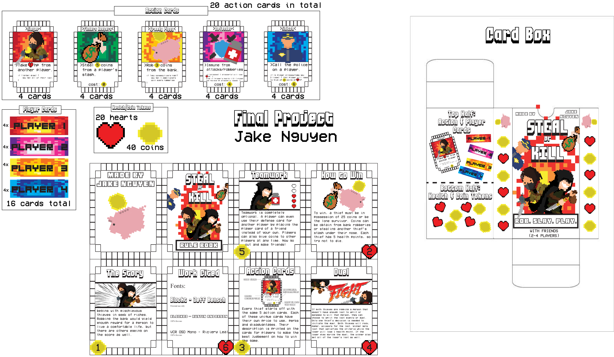

# Kill or Steal
>(2-4 PLAYERS)

## The Story
>begins with mischievous thieves in seek of riches. Robbing the bank would yield enough reward for a person to live a comfortable life, but there are others eyeing on the score as well.

## How To Win
>To win, a thief must be in possession of 25 coins or be the lone survivor. Coins can be obtain from bank robberies or stealing another thief’s stash under their nose. Each thief has 5 health points, so try not to die.

## Action Cards
>Every thief starts off with the same 5 action cards. Each of these unique cards have their own price to use, perks and disadvantages. Their description is printed on the cards for players to make the best judgement on how to win the game. 

## Duel
>If both thieves are robbing a person that doesn’t have enough loot to split or managed to kill that person, they can choose to split the loot evenly or duel. Only one thief’s decision is needed to initiate the duel. Both thieves will rock, paper, scissors for the loot. Winner gets loot that satisfies the criteria while the loser will lose 1 health point. If the loser dies during the duel, the winner also get all of the loser’s loot as well

## Teamwork
>Teamwork is completely optional. A player can even use their defense card for another player by placing the player card of a friend instead of your own. Players can also give coins to other players at any time. Now go      out and make friends! 
